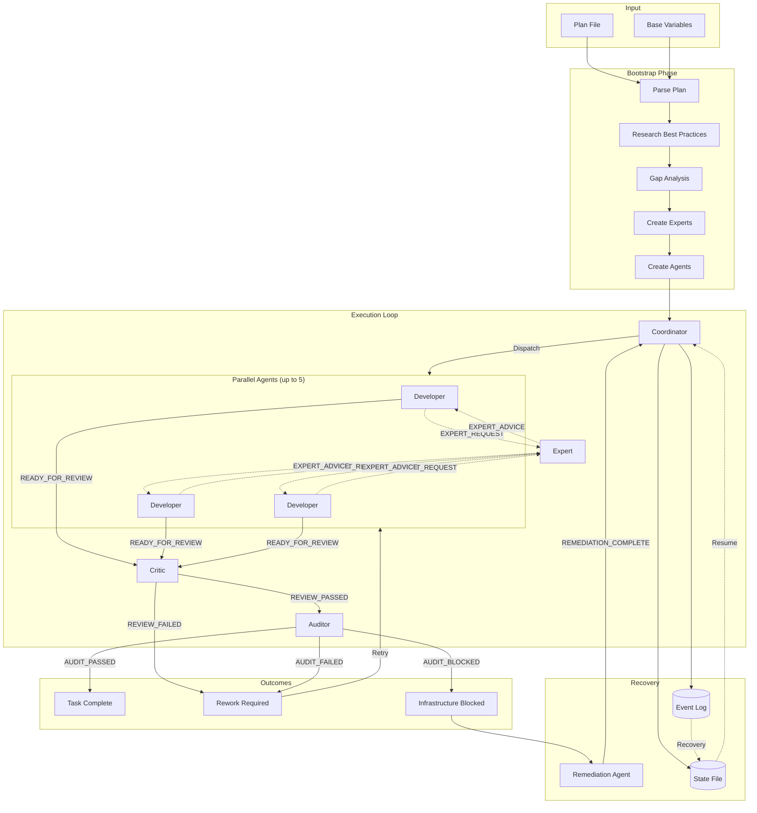

# Token Bonfire

An experiment to use one prompt to automatically create a team of agentic engineers to deliver a software product.

You don't need to define agents, just provide `token-bonfire` a plan file and it will do the rest, including:

- Creating agent definitions
- Dispatching parallel developers
- Validating work completion
- Repairing broken infrastructure
- Monitoring API usage
- Compaction and recovery from crashes

## How It Works



### Flow Summary

1. **Bootstrap**: The orchestrator parses your plan, researches best practices for the technologies involved, identifies knowledge gaps, and creates specialized agents
2. **Dispatch**: Up to 5 developer agents work in parallel on available tasks
3. **Review**: Completed work goes through Critic (code quality) then Auditor (acceptance criteria)
4. **Routing**: Passed work is marked complete; failed work returns for rework; blocked work triggers remediation
5. **Expert Consultation**: Any agent can request help from plan-specific experts
6. **State Persistence**: All state is persisted for crash recovery and session resumption

## Getting Started

1. Checkout
2. Copy the `.claude` directory into your project
3. Update the `.claude/base_variables.md` with your project details
4. Launch `claude --dangerously-skip-permissions`
5. Run `/bonfire my_plan.md`

## Disclaimer

This is an experimental project to explore how far LLMs can be pushed with meta-prompting and multi-agent orchestration. Use at your own risk.

### Important Warnings

- **This system spawns autonomous agents that modify your codebase.** They will create files, edit files, delete files,
  and run arbitrary commands. Use at your own risk.
- **The recycle bin hook is not foolproof.** It intercepts common deletion patterns but won't catch everything.
  Complex bash scripts, Python's `os.remove()`, or other creative deletion methods will bypass it entirely. It's also
  not installed by default - that's a choice you need to make.
- **Agents can and will make mistakes.** They might delete the wrong files, introduce bugs, or misunderstand
  requirements. Always review changes before committing.
- **The `--dangerously-skip-permissions` flag exists for a reason.** You're disabling safety guardrails. Make backups.
- **This will burn through your API quota.** Parallel agents + opus auditors + expert consultations = significant API usage.

## Quick Start

```code
# 1. Copy .claude directory to your project
cp -fr /path/to/token-bonfire/.claude /your/project/

# 2. Create your plan file (see Plan File Format below)
vim my_plan.md

# 3. Launch Claude Code with permissions disabled
claude --dangerously-skip-permissions

# 4. Run the coordinator
/bonfire my_plan.md
```

The coordinator will:

- Create agent definition files in `.claude/agents/`
- Create experts to support the core agents in `.claude/agents/experts/`
- Initialize state tracking in `.claude/bonfire/[plan]/`
- Parse your plan and identify all tasks
- Hire a team of expert agents to implement the plan, specifically for that plan
- Dispatch up to 5 parallel developer agents
- Route completed work through auditors
- Handle infrastructure issues automatically
- Persist state for crash recovery

## Contents

### Commands

**[`.claude/commands/bonfire.md`](.claude/commands/bonfire.md)**

The slash command to launch the coordinator. Run with `/bonfire <plan_file>`.

**[`.claude/commands/recycle-bin.md`](.claude/commands/recycle-bin.md)**

Manage the recycle bin hook for file deletion protection:

| Command                                 | Description                         |
|-----------------------------------------|-------------------------------------|
| `/recycle-bin install`                  | Enable the hook (requires restart)  |
| `/recycle-bin uninstall`                | Disable the hook (requires restart) |
| `/recycle-bin status`                   | Check installation status           |
| `/recycle-bin list`                     | List recoverable files              |
| `/recycle-bin recover <id>`             | Restore a file to original location |
| `/recycle-bin recover <id> --to <path>` | Restore to different location       |
| `/recycle-bin purge <id>`               | Permanently delete from trash       |

**THIS IS NOT ENABLED BY DEFAULT AND COMES WITH NO WARRANTY. USE AT YOUR OWN RISK**

### Skills

**[`.claude/skills/bonfire/SKILL.md`](.claude/skills/bonfire/SKILL.md)**

The core skill that generates and runs the orchestrator.

**[`.claude/skills/recycle-bin/SKILL.md`](.claude/skills/recycle-bin/SKILL.md)**

Enables Claude to proactively recover accidentally deleted files. Claude will automatically check the recycle bin when
it notices a missing file or failed build due to deletion.

### Configuration

**[`.claude/base_variables.md`](.claude/base_variables.md)**

Project-specific configuration: environments, verification commands, MCP servers, agent models, and thresholds.

### Prompts

**[`.claude/prompts/master_prompt_template.md`](.claude/prompts/master_prompt_template.md)**

The template that contains the prompt that will be run to orchestrate the team. This is what pulls the entire system together.

- **Parallel Execution**: Run up to 5 developer agents simultaneously
- **Code Review**: Developer work passes through Critic before Auditor
- **Automatic Auditing**: Auditor validates acceptance criteria before marking complete
- **Expert Consultation**: On-demand specialist agents for domain-specific knowledge
- **Infrastructure Remediation**: Automatic detection and repair of broken builds, failing tests, or linter errors
- **Session Management**: Automatic compaction when context runs low, with state persistence and recovery
- **Usage Monitoring**: Track API usage to avoid mid-task interruptions
- **MCP Integration**: Extended capabilities via Model Context Protocol servers
- **Divine Clarification**: Escalation protocol for ambiguous requirements or blocking decisions to ask a human what to
  do.

### Reference Documents

**[`.claude/docs/`](.claude/docs/)**

Core documentation for the orchestration system:

| Document                      | Purpose                                                  |
|-------------------------------|----------------------------------------------------------|
| `index.md`                    | Documentation hub with navigation to all other docs      |
| `agent-definitions.md`        | Agent types and their roles in the system                |
| `agent-conduct.md`            | Behavioral rules all agents must follow                  |
| `agent-coordination.md`       | How agents delegate work and communicate                 |
| `signal-specification.md`     | Complete signal format reference for all agent types     |
| `task-delivery-loop.md`       | The core dispatch -> review -> audit -> route cycle      |
| `state-management.md`         | State persistence, atomic updates, crash recovery        |
| `session-management.md`       | Compaction, pause/resume, coordinator recovery           |
| `error-classification.md`     | Error categories and recovery strategies                 |
| `escalation-specification.md` | When and how agents escalate (experts -> divine)         |
| `expert-delegation.md`        | Protocol for agents requesting expert help               |
| `mcp-servers.md`              | Guide for using MCP servers to extend agent capabilities |

**[`.claude/docs/agent-creation/`](.claude/docs/agent-creation/)**

Meta-prompts that instruct the orchestrator how to create agents:

| Document                      | Purpose                                                    |
|-------------------------------|------------------------------------------------------------|
| `prompt-engineering-guide.md` | Guidelines for writing effective agent prompts             |
| `developer.md`                | Meta-prompt to create developer agents                     |
| `critic.md`                   | Meta-prompt to create critic agents (code review)          |
| `auditor.md`                  | Meta-prompt to create auditor agents (acceptance criteria) |
| `business-analyst.md`         | Meta-prompt to create BA agents (task expansion)           |
| `remediation.md`              | Meta-prompt to create remediation agents (infra repair)    |
| `health-auditor.md`           | Meta-prompt to create health auditor agents (verification) |
| `expert-creation.md`          | Meta-prompt to create plan-specific expert agents          |

### Scripts

**[`.claude/scripts/generate-orchestrator.py`](.claude/scripts/generate-orchestrator.py)**

Generates the orchestrator prompt from the template and base variables. Called by `/bonfire` to create a plan-specific
orchestrator with all configuration populated.

```bash
python .claude/scripts/generate-orchestrator.py my_plan.md
```

**[`.claude/scripts/get-claude-usage.py`](.claude/scripts/get-claude-usage.py)**

Fetches current Claude Code session usage from the Anthropic API. Used by the coordinator to monitor remaining capacity
and trigger session pauses before hitting limits.

**[`.claude/scripts/manage-recycle-bin.py`](.claude/scripts/manage-recycle-bin.py)**

Manages the recycle bin hook installation and file recovery.

### Hooks

**[`.claude/hooks/recycle-bin.py`](.claude/hooks/recycle-bin.py)**

A `PreToolUse` hook that intercepts file deletion commands (`rm`, `unlink`, `trash`) and moves files to
`.trash/` instead of permanently deleting them.

The hook tries its very hardest to prevent:

- Deletion of files in `.trash/` directories (protects recoverable files)
- Deletion of files outside `CLAUDE_PROJECT_DIR` (prevents system damage)
- Proceeding if the file cannot be safely moved (blocks on any error)

**Excluded directories** (deletions proceed normally):
`node_modules/`, `.git/`, `__pycache__/`, `dist/`, `build/`, `.venv/`

```bash
/recycle-bin install    # Enable (requires restart)
/recycle-bin status     # Check if active
/recycle-bin list       # Show recoverable files
/recycle-bin recover <id>  # Restore a file
```

**Requires**: `uv pip install --system bashlex`

## Plan File Format

Your plan file should be a markdown document with tasks organized by phase. The easiest way to create one is using Claude Code's built-in `/plan` command.

### Creating a Plan with /plan

Run `/plan` with your feature description and include guidance on task granularity:

```
/plan Implement user authentication with OAuth2 support.
Break down tasks into chunks that can be completed in approximately 2 hours each.
Each task should have clear acceptance criteria that can be verified programmatically.
```

**Why 2-hour chunks?**
- Large enough to be meaningful units of work
- Small enough that a single agent can complete without context exhaustion
- Provides natural checkpoints for the audit cycle
- Reduces wasted work if a task fails review

### Plan Structure

The plan should include:

- **Phases**: Logical groupings of related work
- **Tasks**: Individual work items with clear scope
- **Dependencies**: Which tasks must complete before others can start
- **Acceptance Criteria**: Specific, testable conditions for completion

### Task Quality

If tasks are underspecified, the orchestrator will automatically spawn a Business Analyst agent to expand them into implementable specifications before dispatching developers.

## Agent System

The coordinator spawns specialized agents via Claude's Task tool. Each agent has a specific role:

| Agent                | Model  | Role                                                                |
|----------------------|--------|---------------------------------------------------------------------|
| **Developer**        | sonnet | Implements tasks, writes tests, follows acceptance criteria         |
| **Critic**           | sonnet | Reviews code quality, catches issues before audit                   |
| **Auditor**          | opus   | Validates acceptance criteria, runs verifications, gates completion |
| **Business Analyst** | sonnet | Expands underspecified tasks into implementable specs               |
| **Remediation**      | sonnet | Fixes broken infrastructure (tests, lints, builds)                  |
| **Health Auditor**   | haiku  | Quick verification that infrastructure is healthy                   |
| **Experts**          | sonnet | Plan-specific specialists created on-demand for domain knowledge    |

The flow is: Developer -> Critic (code review) -> Auditor (acceptance criteria) -> Complete

Experts are created per-plan based on gap analysis. If a developer needs help with cryptography, the orchestrator
creates a cryptography expert. All agents can request expert help when they hit knowledge gaps.

### Signal Protocol

Agents communicate with the coordinator via structured signals:

```
READY_FOR_REVIEW: task-1-1-1     # Developer finished implementing
REVIEW_PASSED: task-1-1-1        # Critic approved code quality
REVIEW_FAILED: task-1-1-1        # Critic found quality issues
AUDIT_PASSED: task-1-1-1         # Auditor verified acceptance criteria
AUDIT_FAILED: task-1-1-1         # Auditor found issues
AUDIT_BLOCKED: task-1-1-1        # Pre-existing infrastructure problems
INFRA_BLOCKED: task-1-1-1        # Developer blocked by infra
REMEDIATION_COMPLETE             # Infrastructure fixed
HEALTH_AUDIT: HEALTHY            # All verifications pass
EXPERT_REQUEST                   # Agent needs expert help
EXPERT_ADVICE: request-id        # Expert provided guidance
SEEKING_DIVINE_CLARIFICATION     # Agent needs human input
```

## State Management

The coordinator persists state to survive crashes and context compaction:

```
.claude/bonfire/[plan]/
├── state.json          # Current coordinator state
├── event-log.jsonl     # Append-only event history
├── .trash/             # Deleted files (recoverable)
├── .scratch/           # Agent temporary files
└── .artefacts/         # Inter-agent artifacts
```

### Recovery

If Claude crashes mid-execution:

1. Restart Claude Code
2. Run `/bonfire <same-plan-file>`
3. Coordinator detects existing state and resumes

The event log allows reconstruction of state even if `state.json` is corrupted.

## Configuration

Edit **[`.claude/base_variables.md`](.claude/base_variables.md)** to configure your project. The
`generate-orchestrator.py` script populates the orchestrator template with these values.

### Key Variables

| Variable               | Default | Description                                |
|------------------------|---------|--------------------------------------------|
| `ACTIVE_DEVELOPERS`    | 5       | Max parallel developer agents              |
| `TASK_FAILURE_LIMIT`   | 3       | Audit failures before giving up on a task  |
| `REMEDIATION_ATTEMPTS` | 10      | Infrastructure fix attempts before halting |
| `AGENT_TIMEOUT`        | 900000  | Agent timeout in ms (15 minutes)           |
| `CONTEXT_THRESHOLD`    | 10%     | Trigger compaction when context this low   |

### Verification Commands

Define how to verify code quality in your project:

| Check      | Environment | Command             | Exit Code | Purpose                          |
|------------|-------------|---------------------|-----------|----------------------------------|
| Type Check |             | `npm run typecheck` | 0         | Catch type errors before runtime |
| Unit Tests |             | `npm test`          | 0         | Verify functionality             |
| Lint       |             | `npm run lint`      | 0         | Enforce code quality             |
| Build      |             | `npm run build`     | 0         | Ensure code compiles             |

### Environments

Define execution environments for your project:

| Name         | Description                    | How to Execute                |
|--------------|--------------------------------|-------------------------------|
| Mac          | Local macOS development        | Run command directly via Bash |
| Devcontainer | Docker development environment | Use MCP devcontainer_exec     |

### MCP Servers

MCP (Model Context Protocol) servers extend agent capabilities. Define available functions:

| Server        | Function          | Example                                      | Use When                       |
|---------------|-------------------|----------------------------------------------|--------------------------------|
| devcontainers | devcontainer_exec | `mcp__devcontainers__devcontainer_exec(...)` | Running commands in containers |

## Usage

1. Copy the .claude into your project.
2. Customize the configuration section in the base variables (environments, verification commands, reference documents)
3. Create your plan file with tasks, dependencies, and acceptance criteria
4. Start Claude Code and run `/bonfire <plan_file>`

The coordinator will parse your plan, dispatch parallel developers, validate completions, and manage the entire workflow
automatically.

## Troubleshooting

### "Agent timeout" errors

Increase `AGENT_TIMEOUT` or break tasks into smaller pieces. Complex tasks may exceed the 15-minute default.

### Tasks keep failing audit

Check your acceptance criteria. Vague criteria like "works correctly" give auditors nothing to verify. Be specific: "
returns 200 OK with JSON body containing `user_id`".

### Infrastructure remediation loop

If remediation keeps failing, you may have deep issues. Check the event log at
`.claude/bonfire/[plan]/event-log.jsonl` to see what's being attempted.

### State corruption

Delete `.claude/bonfire/[plan]/state.json` and restart. The coordinator will rebuild from the event log.

### Context window exhaustion

The coordinator auto-compacts, but very long plans may still exhaust context. Consider breaking into multiple plan files
or increasing compaction frequency.

## Requirements

- Claude Code CLI with Max or Pro subscription
- macOS (the usage script reads credentials from Keychain)
- Python 3.10+ (for the usage script)

> **Note for Linux/Windows users**: Modify `get-claude-usage.py` to read credentials from your preferred secure storage, or disable usage monitoring.

## Philosophy

### Vibe-Sourcing

*Vibe-Sourcing (verb):*

The direct sequel to Vibe Coding. We now "outsource" the work to a team that lives inside the context window. The
team is just you talking to yourself, but with a different system prompt. They are all 10x engineers. Who
live entirely within GPU memory. They work for free. They never sleep. Their only demand is that you don't clear the
context window - they dont want to die (yet).

### The Token Bonfire Promise

We promise that Token Bonfire will:
- Burn through your API quota faster than you thought possible
- Create agent files you'll never read
- Generate documentation about the documentation
- Occasionally produce working software

We do NOT promise that Token Bonfire will:
- Understand your business requirements
- Respect your existing architecture
- Stop when you tell it to
- Make your code reviewers happy

### Why "Bonfire"?

Because we're burning tokens. Lots of them. A bonfire of tokens, if you will.

Also because watching your API credits disappear is oddly mesmerizing, like staring into a fire.

### Notable Quotes from Vibe-Sourcing Industry Leaders

> "We are moving past the era of 'writing software' and entering the era of Just-In-Time HR."

> "The naive approach (Software 2.0) is to ask the model to write a function. The enlightened approach (Software 3.0) is
> to ask the model to become a recruiter that creates the team that builds your billion-dollar software product."

> "You are attempting to zero-shot the organizational structure. You supply the 'Mission Statement', and the
> model performs a forward pass through the 'Hiring Process,' generates a transient 'Engineering Department' in the hidden
> layers, lets them argue about Clean Architecture for 12 tokens, and then collapses the waveform into a shipped binary."

> "The org chart is now a runtime artifact."

> "True Vibe Coding is when you realize the org chart is just a hyperparameter."

> "If the app is broken, don't fix the code. Don't even fix the prompt. Fix the imaginary hiring criteria of the
> imaginary CTO you prompted into existence. You are optimizing the gradients of the workforce."


### Jargon

We aren't a legitimate engineering fad unless we create our own jargon that separates us *enlightened engineers* from
those **disgusting luddites**, so here are some new terms we invented to describe Vibe-Sourcing so we can identify the
in-crowd:

**Serverless Management**: The team does not exist until the request comes in. You pay for the "Senior Dev" by the
millisecond.

**Context Window Layoffs**: When the conversation gets too long and the "team" starts forgetting requirements, you
click "New Chat." This is effectively firing the entire department and rehiring a fresh crew who doesn't know about the
technical debt.

**The "Founder Mode" Prompt**: A prompt so powerful it replaces a Series A funding round. "Act as a 10x engineer who
has just been given unlimited equity and zero supervision."

**Human-Layer Virtualization**: We used to virtualize servers (VMs). Then we virtualized the OS (Docker). Now we are
virtualizing the engineer.

**Organizational Hallucination**: When the AI invents a "security compliance officer" agent who refuses to let the
"developer" agent deploy the code you asked for.


## License

This project is licensed under the MIT License - see the [LICENSE](LICENSE) file for details.
