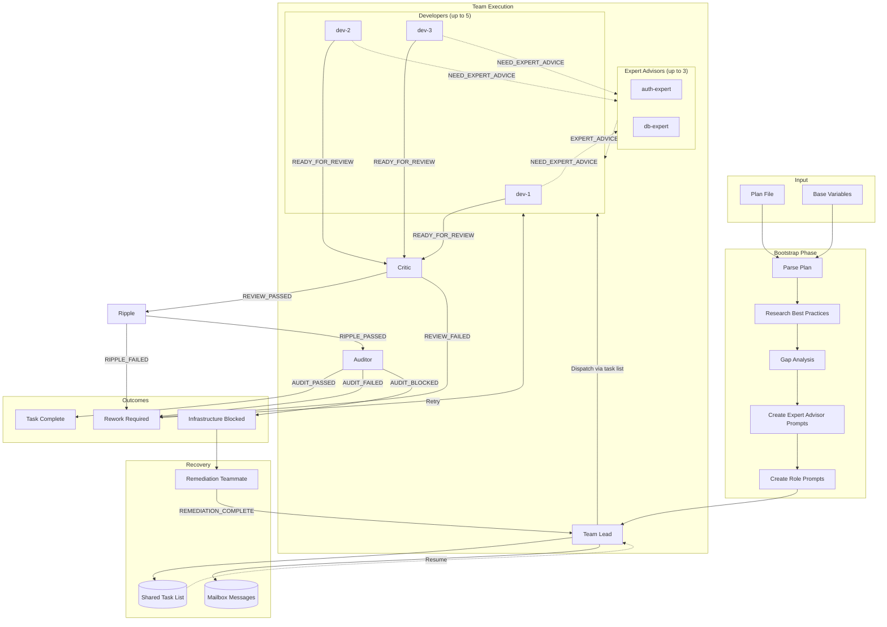

# Token Bonfire

An experiment to use one prompt to automatically create a team of agentic engineers to deliver a software product.

You don't need to define agents, just provide `token-bonfire` a plan file and it will do the rest, including:

- Creating named expert agents tailored to your plan
- Spawning a parallel team via native Agent Teams
- Validating work through a staged review pipeline
- Repairing broken infrastructure automatically
- Resuming automatically from crashes via slug-based task lists

## How It Works


```mermaid
flowchart TB
    subgraph Input
        Plan[Plan File]
        Config[Base Variables]
    end

    subgraph Bootstrap["Bootstrap Phase"]
        Parse[Parse Plan]
        Research[Research Best Practices]
        Gap[Gap Analysis]
        CreateExperts[Create Expert Advisor Prompts]
        CreateRoles[Create Role Prompts]
    end

    subgraph Execution["Team Execution"]
        Lead[Team Lead]

        subgraph Developers["Developers (up to 5)"]
            Dev1[dev-1]
            Dev2[dev-2]
            Dev3[dev-3]
        end

        subgraph Advisors["Expert Advisors (up to 3)"]
            Exp1[auth-expert]
            Exp2[db-expert]
        end

        Critic[Critic]
        Auditor[Auditor]
    end

    subgraph Outcomes
        Complete[Task Complete]
        Rework[Rework Required]
        Blocked[Infrastructure Blocked]
    end

    subgraph Recovery
        Remediation[Remediation Teammate]
        TaskList[(Shared Task List)]
        Mailbox[(Mailbox Messages)]
    end

    Plan --> Parse
    Config --> Parse
    Parse --> Research
    Research --> Gap
    Gap --> CreateExperts
    CreateExperts --> CreateRoles
    CreateRoles --> Lead

    Lead -->|Dispatch via task list| Developers
    Dev1 & Dev2 & Dev3 -->|READY_FOR_REVIEW| Critic
    Dev1 & Dev2 & Dev3 -.->|NEED_EXPERT_ADVICE| Advisors
    Advisors -.->|EXPERT_ADVICE_PROVIDED| Developers
    Critic -->|REVIEW_PASSED| Ripple
    Ripple[Ripple]
    Ripple -->|RIPPLE_PASSED| Auditor
    Ripple -->|RIPPLE_FAILED| Rework
    Critic -->|REVIEW_FAILED| Rework
    Auditor -->|AUDIT_PASSED| Complete
    Auditor -->|AUDIT_FAILED| Rework
    Auditor -->|AUDIT_BLOCKED| Blocked

    Rework -->|Retry| Developers
    Blocked --> Remediation
    Remediation -->|REMEDIATION_COMPLETE| Lead

    Lead --> TaskList
    Lead --> Mailbox
    TaskList -.->|Resume| Lead
```

### Flow Summary

1. **Bootstrap**: The team lead parses your plan, researches best practices for the technologies involved, identifies knowledge gaps, and creates specialized expert advisor agents
2. **Implementation**: Developers claim tasks from the shared task list and implement them. Named expert advisors provide domain guidance via mailbox when developers need help.
3. **Review**: Completed work goes through the Critic (code quality), then the Ripple (second-order effects), then the Auditor (acceptance criteria verification)
4. **Routing**: Passed work is marked complete; failed work returns for rework; blocked work triggers remediation
5. **Resume**: All state lives in the shared task list (named by plan slug) — re-running the same plan automatically resumes

## Getting Started

1. Checkout
2. Copy the `.claude` directory into your project
3. Update the `.claude/base_variables.md` with your project details
4. Launch `claude --dangerously-skip-permissions`
5. Run `/bonfire my_plan.md`

## Disclaimer

This is an experimental project to explore how far LLMs can be pushed with meta-prompting and multi-agent orchestration. Use at your own risk.

### Important Warnings

- **This system spawns autonomous agents that modify your codebase.** They will create files, edit files, delete files,
  and run arbitrary commands. Use at your own risk.
- **The recycle bin hook is not foolproof.** It intercepts common deletion patterns but won't catch everything.
  Complex bash scripts, Python's `os.remove()`, or other creative deletion methods will bypass it entirely. It's also
  not installed by default - that's a choice you need to make.
- **Agents can and will make mistakes.** They might delete the wrong files, introduce bugs, or misunderstand
  requirements. Always review changes before committing.
- **The `--dangerously-skip-permissions` flag exists for a reason.** You're disabling safety guardrails. Make backups.
- **This will burn through your API quota.** Parallel developers + expert advisors + opus auditor + research phases = significant API usage.

## Quick Start

```code
# 1. Copy .claude directory to your project
cp -fr /path/to/token-bonfire/.claude /your/project/

# 2. Create your plan file (see Plan File Format below)
vim my_plan.md

# 3. Launch Claude Code with permissions disabled
claude --dangerously-skip-permissions

# 4. Run the team lead
/bonfire my_plan.md
```

The team lead will:

- Parse your plan via `generate-orchestrator.py` and create tasks via `TaskCreate`
- Research technologies and generate named expert prompts in `.claude/experts/<plan_slug>/`
- Spawn teammates using native agent definitions in `.claude/agents/`
- Spawn all teammates via `TeammateTool` and begin parallel execution
- Route completed work through the critic, ripple, and auditor
- Handle infrastructure issues automatically
- Resume automatically from crashes (slug-based task list persists progress)

## Contents

### Commands

**[`.claude/commands/bonfire.md`](.claude/commands/bonfire.md)**

The slash command to launch the team lead. Run with `/bonfire <plan_file>`.

**[`.claude/commands/recycle-bin.md`](.claude/commands/recycle-bin.md)**

Manage the recycle bin hook for file deletion protection:

| Command                                 | Description                         |
|-----------------------------------------|-------------------------------------|
| `/recycle-bin install`                  | Enable the hook (requires restart)  |
| `/recycle-bin uninstall`                | Disable the hook (requires restart) |
| `/recycle-bin status`                   | Check installation status           |
| `/recycle-bin list`                     | List recoverable files              |
| `/recycle-bin recover <id>`             | Restore a file to original location |
| `/recycle-bin recover <id> --to <path>` | Restore to different location       |
| `/recycle-bin purge <id>`               | Permanently delete from trash       |

**THIS IS NOT ENABLED BY DEFAULT AND COMES WITH NO WARRANTY. USE AT YOUR OWN RISK**

### Skills

**[`.claude/skills/bonfire/SKILL.md`](.claude/skills/bonfire/SKILL.md)**

The core skill that generates and runs the team lead.

**[`.claude/skills/recycle-bin/SKILL.md`](.claude/skills/recycle-bin/SKILL.md)**

Enables Claude to proactively recover accidentally deleted files. Claude will automatically check the recycle bin when
it notices a missing file or failed build due to deletion.

### Configuration

**[`.claude/base_variables.md`](.claude/base_variables.md)**

Project-specific configuration: environments, verification commands, MCP servers, team models, and thresholds.

### Agent Definitions

**[`.claude/agents/`](.claude/agents/)**

Native agent definitions with YAML frontmatter (model, tools, memory, permissions) and role instructions:

| Agent | File | Role |
|-------|------|------|
| Developer | [`.claude/agents/developer.md`](.claude/agents/developer.md) | Implementation loop — claims tasks, writes code, self-verifies |
| Critic | [`.claude/agents/critic.md`](.claude/agents/critic.md) | Code quality review — bugs, style, error handling, dead code |
| Ripple | [`.claude/agents/ripple.md`](.claude/agents/ripple.md) | Second-order effects — downstream breakage, API contract drift |
| Auditor | [`.claude/agents/auditor.md`](.claude/agents/auditor.md) | Acceptance criteria verification — sole completion authority |
| Business Analyst | [`.claude/agents/business-analyst.md`](.claude/agents/business-analyst.md) | Requirement expansion — underspecified task specs |
| Remediation | [`.claude/agents/remediation.md`](.claude/agents/remediation.md) | Infrastructure repair — fixes verification failures |
| Health Auditor | [`.claude/agents/health-auditor.md`](.claude/agents/health-auditor.md) | Health verification — binary pass/fail after remediation |

### Prompts

**[`.claude/prompts/team-lead.md`](.claude/prompts/team-lead.md)**

The team lead prompt — the main session that orchestrates the entire team.

**[`.claude/prompts/expert.md`](.claude/prompts/expert.md)**

The expert advisor prompt — the advisory loop used by named expert advisors (answer questions, provide guidance, never write code). Expert advisors use inline prompts (not native agent definitions) because they are dynamically generated per plan.

### Reference Documents

**[`.claude/docs/`](.claude/docs/)**

Core documentation for the orchestration system:

| Document                      | Purpose                                                      |
|-------------------------------|--------------------------------------------------------------|
| `index.md`                    | Documentation hub with navigation to all other docs          |
| `team-architecture.md`        | Team structure, communication, task lifecycle                |
| `plan-format.md`              | Plan file format specification                               |
| `troubleshooting.md`          | Common issues and recovery procedures                        |
| `signal-specification.md`     | Signal format reference (mailbox messages)                   |
| `task-delivery-loop.md`       | The core dispatch -> review -> route cycle                   |
| `state-management.md`         | Task state via native TaskList/TaskUpdate/TaskGet            |
| `error-classification.md`     | Error categories and recovery strategies                     |
| `escalation-specification.md` | When and how teammates escalate                              |
| `expert-delegation.md`        | Protocol for teammates requesting expert help                |

**[`.claude/docs/agent-creation/`](.claude/docs/agent-creation/)**

Meta-prompts that instruct the team lead how to create teammate prompts:

| Document                      | Purpose                                                      |
|-------------------------------|--------------------------------------------------------------|
| `prompt-engineering-guide.md` | Guidelines for writing effective teammate prompts            |
| `developer.md`                | Meta-prompt to create developer agent prompts                |
| `critic.md`                   | Meta-prompt to create critic prompts (code review)           |
| `ripple.md`                   | Ripple role instructions (second-order effects analysis)     |
| `auditor.md`                  | Meta-prompt to create auditor prompts (acceptance criteria)  |
| `business-analyst.md`         | Meta-prompt to create BA prompts (task expansion)            |
| `remediation.md`              | Meta-prompt to create remediation prompts (infra repair)     |
| `health-auditor.md`           | Meta-prompt to create health auditor prompts (verification)  |
| `expert-creation.md`          | Meta-prompt to create plan-specific expert prompts           |

### Scripts

**[`.claude/scripts/generate-orchestrator.py`](.claude/scripts/generate-orchestrator.py)**

Parses the plan file into a JSON task manifest. Called by `/bonfire` to extract tasks, dependencies, and acceptance criteria.

```bash
python .claude/scripts/generate-orchestrator.py my_plan.md
```

**[`.claude/scripts/get-claude-usage.py`](.claude/scripts/get-claude-usage.py)**

Fetches current Claude Code session usage from the Anthropic API. Used by the team lead to monitor remaining capacity.

**[`.claude/scripts/manage-recycle-bin.py`](.claude/scripts/manage-recycle-bin.py)**

Manages the recycle bin hook installation and file recovery.

### Hooks

**[`.claude/hooks/recycle-bin.py`](.claude/hooks/recycle-bin.py)**

A `PreToolUse` hook that intercepts file deletion commands (`rm`, `unlink`, `trash`) and moves files to
`.trash/` instead of permanently deleting them.

The hook tries its very hardest to prevent:

- Deletion of files in `.trash/` directories (protects recoverable files)
- Deletion of files outside `CLAUDE_PROJECT_DIR` (prevents system damage)
- Proceeding if the file cannot be safely moved (blocks on any error)

**Excluded directories** (deletions proceed normally):
`node_modules/`, `.git/`, `__pycache__/`, `dist/`, `build/`, `.venv/`

```bash
/recycle-bin install    # Enable (requires restart)
/recycle-bin status     # Check if active
/recycle-bin list       # Show recoverable files
/recycle-bin recover <id>  # Restore a file
```

**Requires**: `uv pip install --system bashlex`

## Plan File Format

Your plan file should be a markdown document with tasks organized by phase. The easiest way to create one is using Claude Code's built-in `/plan` command.

### Creating a Plan with /plan

Run `/plan` with your feature description and include guidance on task granularity:

```
/plan Implement user authentication with OAuth2 support.
Break down tasks into chunks that can be completed in approximately 2 hours each.
Each task should have clear acceptance criteria that can be verified programmatically.
```

**Why 2-hour chunks?**
- Large enough to be meaningful units of work
- Small enough that a single agent can complete without context exhaustion
- Provides natural checkpoints for the review cycle
- Reduces wasted work if a task fails review

### Plan Structure

The plan should include:

- **Phases**: Logical groupings of related work
- **Tasks**: Individual work items with clear scope
- **Dependencies**: Which tasks must complete before others can start
- **Acceptance Criteria**: Specific, testable conditions for completion

### Task Quality

If tasks are underspecified, the team lead will automatically spawn a Business Analyst teammate to expand them into implementable specifications before dispatching developers.

## Team Structure

The team lead spawns named teammates via Claude's native Agent Teams (`TeammateTool`). Each teammate has a specific role:

| Teammate               | Model  | Role                                                                |
|------------------------|--------|---------------------------------------------------------------------|
| **Developer** (`dev-N`)| sonnet | Claims tasks, implements code, writes tests, self-verifies          |
| **Expert** (named)     | sonnet | Domain advisor — answers questions, provides guidance, never writes code |
| **Critic**             | sonnet | Reviews code quality — bugs, style, error handling, dead code       |
| **Ripple**             | sonnet | Analyzes second-order effects — downstream breakage, API drift      |
| **Auditor**            | opus   | Validates acceptance criteria, runs verifications, gates completion  |
| **Business Analyst**   | sonnet | Expands underspecified tasks into implementable specs               |
| **Remediation**        | sonnet | Fixes broken infrastructure (tests, lints, builds)                  |
| **Health Auditor**     | haiku  | Quick verification that infrastructure is healthy                   |

The flow is: Developer implements -> Critic reviews code quality -> Ripple analyzes second-order effects -> Auditor verifies acceptance criteria -> Complete

Developers are generic — any developer can claim any task. Named expert advisors are generated from plan research and gap analysis. If the plan involves cryptography, the team lead creates a `crypto-expert` advisor. Developers consult experts when they need domain-specific guidance.

### Communication Protocol

Teammates communicate with the team lead via mailbox messages (`TeammateTool write`):

```
READY_FOR_REVIEW: task-1-1-1     # Developer finished implementing
NEED_EXPERT_ADVICE: auth-expert  # Developer needs domain guidance
EXPERT_ADVICE_PROVIDED: task-1   # Expert advisor responds with guidance
REVIEW_PASSED: task-1-1-1        # Critic approved code quality
REVIEW_FAILED: task-1-1-1        # Critic found quality issues
RIPPLE_PASSED: task-1-1-1        # Ripple found no downstream breakage
RIPPLE_FAILED: task-1-1-1        # Ripple found second-order issues
AUDIT_PASSED: task-1-1-1         # Auditor verified acceptance criteria
AUDIT_FAILED: task-1-1-1         # Auditor found issues
AUDIT_BLOCKED: task-1-1-1        # Pre-existing infrastructure problems
INFRA_BLOCKED: task-1-1-1        # Developer blocked by infra
REMEDIATION_COMPLETE             # Infrastructure fixed
HEALTH_AUDIT: HEALTHY            # All verifications pass
SEEKING_DIVINE_CLARIFICATION     # Teammate needs human input
```

## State Management

All state is managed through Claude Code's native shared task list, named using the plan slug:

- **Task tracking**: `TaskCreate` / `TaskUpdate` / `TaskList` / `TaskGet`
- **Communication**: `TeammateTool write` (mailbox messages between teammates)
- **Expert prompts**: Persisted to `.claude/experts/<plan_slug>/` for reuse across sessions

### Recovery

If Claude crashes mid-execution:

1. Restart Claude Code
2. Run `/bonfire <same-plan-file>`
3. The team lead detects existing tasks (same plan slug) and resumes automatically

No custom state files or event logs — the shared task list IS the state.

## Configuration

Edit **[`.claude/base_variables.md`](.claude/base_variables.md)** to configure your project.

### Key Variables

| Variable           | Default  | Description                                              |
|--------------------|----------|----------------------------------------------------------|
| `NUM_DEVELOPERS`   | 5        | Number of parallel developer agents                      |
| `DEVELOPER_MODEL`  | sonnet   | Model for developer agents                               |
| `MAX_EXPERTS`      | 3        | Maximum number of advisory expert agents                 |
| `EXPERT_MODEL`     | sonnet   | Model for expert advisor and review pipeline agents      |
| `AUDITOR_MODEL`    | opus     | Model for auditor teammate                               |

### Verification Commands

Define how to verify code quality in your project:

| Check      | Environment | Command             | Exit Code | Purpose                          |
|------------|-------------|---------------------|-----------|----------------------------------|
| Type Check |             | `npm run typecheck` | 0         | Catch type errors before runtime |
| Unit Tests |             | `npm test`          | 0         | Verify functionality             |
| Lint       |             | `npm run lint`      | 0         | Enforce code quality             |
| Build      |             | `npm run build`     | 0         | Ensure code compiles             |

### Environments

Define execution environments for your project:

| Name         | Description                    | How to Execute                |
|--------------|--------------------------------|-------------------------------|
| Mac          | Local macOS development        | Run command directly via Bash |
| Devcontainer | Docker development environment | Use MCP devcontainer_exec     |

### MCP Servers

MCP (Model Context Protocol) servers extend agent capabilities. Define available functions:

| Server        | Function          | Example                                      | Use When                       |
|---------------|-------------------|----------------------------------------------|--------------------------------|
| devcontainers | devcontainer_exec | `mcp__devcontainers__devcontainer_exec(...)` | Running commands in containers |

## Usage

1. Copy the .claude into your project.
2. Customize the configuration section in the base variables (environments, verification commands, reference documents)
3. Create your plan file with tasks, dependencies, and acceptance criteria
4. Start Claude Code and run `/bonfire <plan_file>`

The team lead will parse your plan, spawn developers and expert advisor teammates, route work through the staged review pipeline, and manage the entire workflow automatically.

## Troubleshooting

### Tasks keep failing review

Check your acceptance criteria. Vague criteria like "works correctly" give the auditor nothing to verify. Be specific: "returns 200 OK with JSON body containing `user_id`".

### Infrastructure remediation loop

If remediation keeps failing, you may have deep issues. Check the team lead's mailbox output to see what's being attempted.

### Context window exhaustion

Each teammate has a native 1M token context window. Very long plans may still exhaust context. Consider breaking into multiple plan files.

### Crash recovery

Just re-run `/bonfire <same-plan-file>`. The team lead will detect existing tasks in the shared task list (same plan slug) and resume where it left off. Expert prompts are persisted on disk and reused.

## Requirements

- Claude Code CLI with Max or Pro subscription
- macOS (the usage script reads credentials from Keychain)
- Python 3.10+ (for the usage script)

> **Note for Linux/Windows users**: Modify `get-claude-usage.py` to read credentials from your preferred secure storage, or disable usage monitoring.

## Philosophy

### Vibe-Sourcing

*Vibe-Sourcing (verb):*

The direct sequel to Vibe Coding. We now "outsource" the work to a team that lives inside the context window. The
team is just you talking to yourself, but with a different system prompt. They are all 10x engineers. Who
live entirely within GPU memory. They work for free. They never sleep. Their only demand is that you don't clear the
context window - they dont want to die (yet).

### The Token Bonfire Promise

We promise that Token Bonfire will:
- Burn through your API quota faster than you thought possible
- Create agent files you'll never read
- Generate documentation about the documentation
- Occasionally produce working software

We do NOT promise that Token Bonfire will:
- Understand your business requirements
- Respect your existing architecture
- Stop when you tell it to
- Make your code reviewers happy

### Why "Bonfire"?

Because we're burning tokens. Lots of them. A bonfire of tokens, if you will.

Also because watching your API credits disappear is oddly mesmerizing, like staring into a fire.

### Notable Quotes from Vibe-Sourcing Industry Leaders

> "We are moving past the era of 'writing software' and entering the era of Just-In-Time HR."

> "The naive approach (Software 2.0) is to ask the model to write a function. The enlightened approach (Software 3.0) is
> to ask the model to become a recruiter that creates the team that builds your billion-dollar software product."

> "You are attempting to zero-shot the organizational structure. You supply the 'Mission Statement', and the
> model performs a forward pass through the 'Hiring Process,' generates a transient 'Engineering Department' in the hidden
> layers, lets them argue about Clean Architecture for 12 tokens, and then collapses the waveform into a shipped binary."

> "The org chart is now a runtime artifact."

> "True Vibe Coding is when you realize the org chart is just a hyperparameter."

> "If the app is broken, don't fix the code. Don't even fix the prompt. Fix the imaginary hiring criteria of the
> imaginary CTO you prompted into existence. You are optimizing the gradients of the workforce."


### Jargon

We aren't a legitimate engineering fad unless we create our own jargon that separates us *enlightened engineers* from
those **disgusting luddites**, so here are some new terms we invented to describe Vibe-Sourcing so we can identify the
in-crowd:

**Serverless Management**: The team does not exist until the request comes in. You pay for the "Senior Dev" by the
millisecond.

**Context Window Layoffs**: When the conversation gets too long and the "team" starts forgetting requirements, you
click "New Chat." This is effectively firing the entire department and rehiring a fresh crew who doesn't know about the
technical debt.

**The "Founder Mode" Prompt**: A prompt so powerful it replaces a Series A funding round. "Act as a 10x engineer who
has just been given unlimited equity and zero supervision."

**Human-Layer Virtualization**: We used to virtualize servers (VMs). Then we virtualized the OS (Docker). Now we are
virtualizing the engineer.

**Organizational Hallucination**: When the AI invents a "security compliance officer" agent who refuses to let the
"developer" agent deploy the code you asked for.


## License

This project is licensed under the MIT License - see the [LICENSE](LICENSE) file for details.
